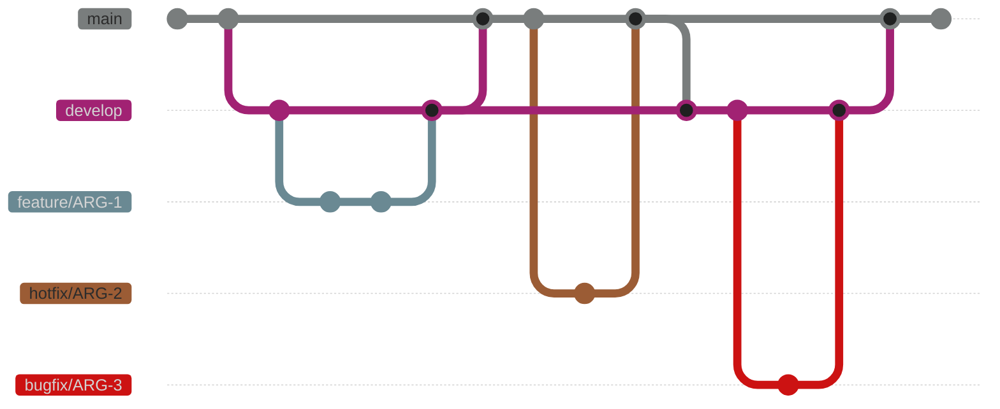

# Backend Convention

# API Design

## 1. 기본 원칙

### 1.1 RESTful 원칙

- **무상태성(Stateless)**: 각 요청은 독립적이며 완전한 정보 포함
- **리소스 중심**: URL은 리소스를 나타내며, HTTP 메서드로 행위 표현
- **일관성**: 전체 API에서 동일한 규칙과 패턴 사용
- **계층 구조**: 리소스 간의 관계를 URL 구조로 표현

## 2. URL 설계 규칙

### 2.1 기본 구조

```
https://rest-api.argosidentity.com/v4/{resource}/{id}/{sub-resource}
```

### 2.2 명명 규칙

- **소문자 사용**: `/users` (O), `/Users` (X)
- **하이픈 사용**: `/user-profiles` (O), `/user_profiles` (X)
- **복수형 사용**: `/users` (O), `/user` (X)
- **동사 사용 금지**: `/users` (O), `/getUsers` (X)

### 2.3 리소스 구조 예시

```
GET    /users                 # 사용자 목록 조회
GET    /users/123             # 특정 사용자 조회
POST   /users                 # 사용자 생성
PUT    /users/123             # 사용자 전체 수정
PATCH  /users/123             # 사용자 부분 수정
DELETE /users/123             # 사용자 삭제

GET    /users/123/orders      # 특정 사용자의 주문 목록
GET    /users/123/orders/456  # 특정 사용자의 특정 주문
```

## 3. HTTP 메서드 사용

### 3.1 메서드별 용도

| 메서드 | 용도 | 멱등성 | 안전성 | 본문 |
| --- | --- | --- | --- | --- |
| GET | 조회 | O | O | X |
| POST | 생성, action | X | X | O |
| PUT | 전체 수정 | O | X | O |
| PATCH | 부분 수정 | X | X | O |
| DELETE | 삭제 | O | X | X |

### 3.2 사용 규칙

- **GET**: 절대 데이터 변경 없음, 캐시 가능
- **POST**: 새 리소스 생성, 매번 다른 결과 가능
- **PUT**: 리소스 전체 교체, 없으면 생성
- **PATCH**: 일부 필드만 수정
- **DELETE**: 리소스 삭제, 여러 번 호출해도 같은 결과

## 4. 필터링, 정렬, 페이징

```jsx
- array는 querystring에서 comma로 구분하여 표현하여 전달합니다.
- object는 querystring에 전달하지 않습니다. userName, userId 처럼 flat한 형태로 전달합니다.
```

### 6.1 필터링

```
GET /users?status=active&role=admin
GET /users?startDate=2024-01-01&endDate=2024-12-31
```

### 6.2 정렬

```
GET /users?sort=createdAt&order=asc
```

### 6.3 페이징

```
# Offset 기반
GET /users?page=2&limit=20

# Cursor 기반
GET /users?cursor=eyJpZCI6MTAwfQ&limit=20
```

### 6.4 필드 선택

```
GET /users?fields=id,name,email
GET /users?exclude=password,sensitiveData
```

## 5. 상태 코드

### 4.1 성공 응답 (2xx)

- **200 OK**: 요청 성공 (GET, PUT, PATCH)
- **201 Created**: 생성 성공 (POST)
- **202 Accepted**: 요청 접수, 비동기 처리 예정
- **204 No Content**: 성공했지만 응답 본문 없음 (DELETE)

### 4.2 리다이렉션 (3xx)

- **301 Moved Permanently**: 영구 이동
- **302 Found**: 임시 이동
- **304 Not Modified**: 캐시된 데이터 사용

### 4.3 클라이언트 오류 (4xx)

- **400 Bad Request**: 잘못된 요청
- **401 Unauthorized**: 인증 필요
- **403 Forbidden**: 권한 없음
- **404 Not Found**: 리소스 없음
- **405 Method Not Allowed**: 허용되지 않은 메서드
- **409 Conflict**: 충돌 (중복 등)
- **422 Unprocessable Entity**: 유효성 검증 실패
- **429 Too Many Requests**: 요청 제한 초과

### 4.4 서버 오류 (5xx)

- **500 Internal Server Error**: 서버 내부 오류
- **502 Bad Gateway**: 게이트웨이 오류
- **503 Service Unavailable**: 서비스 일시 중단
- **504 Gateway Timeout**: 게이트웨이 시간 초과

## 6. 요청/응답 형식

### 5.1 요청 헤더

```bash
Content-Type: application/json
Accept: application/json
X-Api-Key: {apiKey}
```

### 5.2 응답 형식

응답 객체내 optional인 필드는 null이나 “”가 아닌 `응답하지 않는 것`을 기조로 합니다.

**성공 응답 (단일 객체)**

```json
{
	"traceId": "018dc974-5e39-7370-a683-1234567890ab", // uuid v7
	"item":{
		"id": 123,
	  "name": "John Doe",
	  "email": "john@example.com"
	}
}
```

**성공 응답 (목록)**

```json
{
  "traceId":"01890d3e-6480-7cc3-9639-7f8c8e939699", // uuid v7
  "count": 123,
  "nextCursor": "dXNlcjpVMDYxTkZUVDI", // createTime, id 인코딩한 opaque 토큰
  "items": [
    {"id": 1, "name": "Item 1"},
    {"id": 2, "name": "Item 2"}
  ]
}
```

**오류 응답**

```json
{
  "traceId": "018dc974-5e39-7370-a683-1234567890ab", // uuid v7
  "code": "VALIDATION_ERROR",
  "message": "Invalid request data",
  "details": [ // 유효성 검사 라이브러리의 응답 활용
    {
      "field": "email",
      "message": "Invalid email format"
    }
  ]
}
```

## 7. 에러 코드

## 공통

| 상태 코드 | 에러 코드 | 에러 메세지  | 설명 |
| --- | --- | --- | --- |
| 400 | INVALID_REQUEST | Invalid JSON format | body의 json 형식이 잘못되었을 때 |
|  |  | Invalid body | body가 유효하지 않을때 |
|  |  | Invalid query parameters | querystring이 유효하지 않을때 |
| 500 | INTERNAL_SERVER_ERROR | An unexpected error occurred | 알 수 없는 이유로 에러 발생 |


# Common

## Code Formatter

### Prettierrc

`.prettierrc`

```bash
{
  "singleQuote": true,
  "trailingComma": "all",
  "printWidth": 120,
  "semi": true,
  "tabWidth": 2,
  "endOfLine": "lf",
  "bracketSpacing": true
}
```

### ESLint - JavaScript 프로젝트

`dependency`

```jsx
# NPM
npm install --save-dev \
  prettier \
  eslint@^9.0.0 \
  @eslint/js \
  globals \
  @babel/core \
  @babel/eslint-parser \
  eslint-plugin-prettier \
  eslint-config-prettier

# pnpm
pnpm add -D \
  prettier \
  eslint@^9.0.0 \
  @eslint/js \
  globals \
  @babel/core \
  @babel/eslint-parser \
  eslint-plugin-prettier \
  eslint-config-prettier
```

`eslint.config.js` - eslint 9.x

```jsx
import js from '@eslint/js';
import globals from 'globals';
import babelParser from '@babel/eslint-parser';
import prettierPlugin from 'eslint-plugin-prettier';
import prettierConfig from 'eslint-config-prettier';

export default [
  js.configs.recommended,

  {
    files: ['**/*.js'],

    languageOptions: {
      parser: babelParser,
      ecmaVersion: 2022,
      sourceType: 'module',
      parserOptions: {
        requireConfigFile: false,
      },
      globals: {
        ...globals.node,
        ...globals.es2022,
        ...globals.jest,
      },
    },

    plugins: {
      prettier: prettierPlugin,
    },

    rules: {
      curly: ['error', 'all'],
      'no-unused-vars': ['warn', { argsIgnorePattern: '^_', caughtErrorsIgnorePattern: '^_', varsIgnorePattern: '^_'  }],
      'no-var': 'error',
      'prefer-const': 'error',
      'no-duplicate-imports': 'error',
      'no-empty-function': 'warn',
      'prettier/prettier': 'error',
    },
  },

  {
    ignores: ['node_modules/', 'dist/', 'build/', 'coverage/'],
  },
  prettierConfig,
];

```

### ESLint - TypeScript 프로젝트

`dependency`

```bash
# NPM
npm install --save-dev \
  prettier \
  eslint@^9.0.0 \
  typescript \
  @typescript-eslint/eslint-plugin \
  @typescript-eslint/parser \
  eslint-plugin-prettier \
  eslint-config-prettier \
  globals

# pnpm
pnpm add -D \
  prettier \
  eslint@^9.0.0 \
  typescript \
  @typescript-eslint/eslint-plugin \
  @typescript-eslint/parser \
  eslint-plugin-prettier \
  eslint-config-prettier \
  globals

```

`eslint.config.js` - eslint 9.x 

```jsx
import typescriptEslint from '@typescript-eslint/eslint-plugin';
import typescriptParser from '@typescript-eslint/parser';
import prettierConfig from 'eslint-config-prettier';
import prettierPlugin from 'eslint-plugin-prettier';
import globals from 'globals';

export default [
  {
    files: ['**/*.{js,ts}'],
    languageOptions: {
      parser: typescriptParser,
      parserOptions: {
        project: './tsconfig.json',
        sourceType: 'module',
        ecmaVersion: 2022,
      },
      globals: {
        ...globals.node,
        ...globals.jest,
      },
    },
    plugins: {
      '@typescript-eslint': typescriptEslint,
      prettier: prettierPlugin,
    },
    rules: {
      // TypeScript recommended rules
      ...typescriptEslint.configs.recommended.rules,

      // === error ===
      curly: ['error', 'all'],
      '@typescript-eslint/no-unused-vars': ['error', { argsIgnorePattern: '^_', caughtErrorsIgnorePattern: '^_', varsIgnorePattern: '^_'  }],
      'no-duplicate-imports': 'error',
      'no-var': 'error',
      'prefer-const': 'error',

      // === warn ===
      'no-console': 'warn',
      '@typescript-eslint/no-explicit-any': 'warn',

      // Prettier integration
      'prettier/prettier': 'error',
    },
  },
  prettierConfig,
  {
    ignores: ['node_modules/', 'dist/', 'build/', 'coverage/'],
  },
];

```

### settings.json 전역설정

```jsx
  // 에디터 - 포맷팅
  "editor.formatOnSave": true, // 저장 시 자동 포맷팅
  "editor.defaultFormatter": "esbenp.prettier-vscode", // Prettier를 기본 포맷터로
  "editor.tabSize": 2,
  "editor.minimap.size": "fill",

  // 에디터 - 코드 액션
  "editor.codeActionsOnSave": {
    "source.fixAll.eslint": "explicit" // 저장시 ESLint 자동 수정
  },

  // prettier 설정 -> .prettierrc가 우선시 됨. 해당 파일 없는 개인 작업의 포맷팅을 위한 fallback
  "prettier.singleQuote": true,
  "prettier.trailingComma": "all",
  "prettier.printWidth": 120,
  "prettier.semi": true,
  "prettier.tabWidth": 2,
  "prettier.endOfLine": "lf",
  "prettier.bracketSpacing": true,

  // eslint 설정
  "eslint.enable": true,
  "eslint.validate": ["javascript", "typescript", "javascriptreact", "typescriptreact"],

  // 언어별 Import 설정
  "typescript.updateImportsOnFileMove.enabled": "always",
  "javascript.updateImportsOnFileMove.enabled": "always",
```

## Naming

- `kebab-case`
    - URL Path
    - 폴더명
- `camelCase`
    - Request & Response Parameter
    - 변수명, 함수명
    - DB 필드 → snake_case가 권장되지만, 이미 대부분의 필드가 camelCase이므로 기조 유지
    - 람다명
- `UPPER_SNAKE_CASE`
    - 상수
- `PascalCase`
    - 클래스, 인터페이스, 타입

## Git

## 1.  커밋 메시지 작성 예시

```
feat: 로그인 기능 구현
fix: 회원가입 시 이메일 중복 체크 오류 수정
chore: 패키지 의존성 업데이트
test: 결제 모듈 테스트 코드 추가
docs: API 문서 업데이트
```

## 2.  브랜치 이름 작성 예시

```
feature/ARG-123-user-authentication
bugfix/ARG-456-payment-calculation-error
hotfix/ARG-789-security-vulnerability
docs/ARG-234-api-documentation
```

## 3.  브랜치 전략 실전 시나리오

### 시나리오 1: 새 기능 개발

1. develop 브랜치에서 새 브랜치 생성
    
    ```
    git checkout develop
    git pull
    git checkout -b feature/ARG-123-user-authentication
    ```
    
2. 개발 후 커밋 & push
    
    ```
    git add .
    git commit -m "feat: 사용자 인증 기능 구현"
    git push origin feature/ARG-123-user-authentication
    ```
    
3. 해당 브랜치의 작업이 끝난 후 PR 작성 및 머지
    
    ```
    feature/ARG-123-user-authentication -> GitHub에 접속 한 다음 develop 브랜치로 Pull Request 생성
    PR 제목은 변경사항이 명확히 드러나게 작성
    
    Squash merge로 병합
    ```
    

### 시나리오 2: 버그 수정

1. develop 브랜치에서 새 브랜치 생성
    
    ```
    git checkout develop
    git pull
    git checkout -b bugfix/ARG-456-payment-calculation-error
    ```
    
2. 버그 수정 후 커밋 & push
    
    ```
    git add .
    git commit -m "fix: 결제 금액 계산 오류 수정"
    git push origin bugfix/ARG-456-payment-calculation-error
    ```
    
3. 해당 브랜치의 작업이 끝난 후 PR 작성 및 머지
    
    ```
    feature/ARG-123-user-authentication -> GitHub에 접속 한 다음 develop 브랜치로 Pull Request 생성
    PR 제목은 변경사항이 명확히 드러나게 작성
    
    Squash merge로 병합
    ```
    
    - GitHub에서 PR 생성 (develop 브랜치로)
    - PR 제목: "결제 금액 계산 오류 수정"
    - 반드시 1명 이상의 리뷰어 지정 ( 현재 리뷰를 진행하지 않습니다. )
    - 리뷰 승인 후 Squash merge 옵션 선택하여 병합
        
        ```
        # GitHub에서 "Squash and merge" 옵션 선택
        ```
        

### 시나리오 3: 긴급 수정(Hotfix)

1. main 브랜치에서 새 브랜치 생성
    
    ```
    git checkout main
    git pull
    git checkout -b hotfix/ARG-789-security-vulnerability
    
    ```
    
2. 수정 후 커밋  & push
    
    ```
    git commit -m "fix: 보안 취약점 패치"
    git push origin hotfix/ARG-789-security-vulnerability
    ```
    
3. 해당 브랜치의 작업이 끝난 후 PR 작성 및 머지
    
    ```
    feature/ARG-123-user-authentication -> GitHub에 접속 한 다음 develop 브랜치로 Pull Request 생성
    PR 제목은 변경사항이 명확히 드러나게 작성
    
    Squash merge로 병합
    ```
    

### 시나리오 4: 릴리스

1. develop에서 main으로 PR 생성
    - PR 제목: "Release: 2023년 3월 첫 번째 릴리스"
2. 리뷰 후 **일반 merge** (Squash merge 아님)
    
    ```
    # GitHub에 접속 한 다음 "Create a merge commit" 옵션 선택
    ```
    

## 4. PR 리뷰 예시

- 리뷰어는 코드 품질, 테스트 여부, 코딩 컨벤션 준수를 확인
- 예: "로그인 실패 시 에러 처리가 누락되었습니다. 추가해주세요."

## 5. 브랜치 전략 다이어그램



## 7. 브랜치별 역할 요약

| 브랜치 | 역할 | 생성 기준 | 병합 대상 | 병합 전략 |
| --- | --- | --- | --- | --- |
| main | 운영 환경 배포용 | - | - |  |
| develop | 기본 브랜치, 개발 환경 | - | main으로 릴리스 |  |
| release/qa | QA 환경 배포용 (직접 커밋 금지) | - | - |  |
| feature/* | 새 기능 개발 | develop에서 생성 | develop으로 PR | squash merge |
| bugfix/* | 버그 수정 | develop에서 생성 | develop으로 PR | squash merge |
| hotfix/* | 긴급 수정 | main에서 생성 | main으로 PR 후 develop에 병합 |  |
